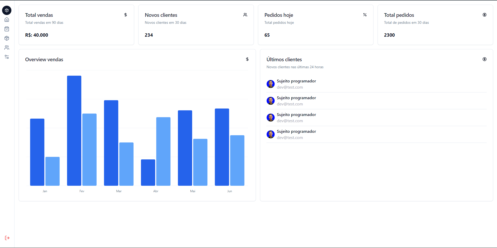
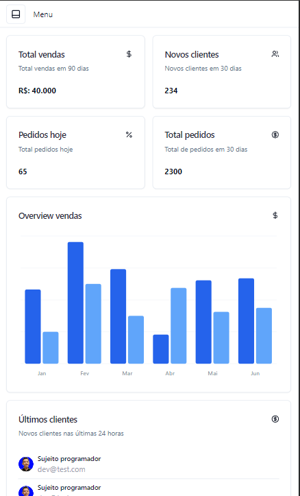
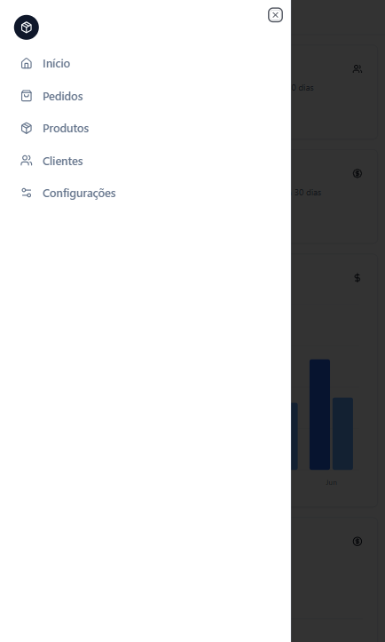

<h1 align="center">🖥️ Dashboard Project</h1>

  Este é um projeto de dashboard desenvolvido com 
  <a href="https://nextjs.org/"><strong>Next.js</strong></a>, 
  <a href="https://tailwindcss.com/"><strong>Tailwind CSS</strong></a> e 
  <a href="https://shadcn.dev/"><strong>ShadcnUI</strong></a>. 
  O objetivo deste projeto é fornecer uma interface de usuário moderna e responsiva 
  para gerenciar dados e visualizar informações de forma eficiente.

<h2>🚀 Tecnologias Utilizadas</h2>
<ul>
  <li><strong>Next.js</strong>: Framework React para aplicações web, com suporte para renderização do lado do servidor (SSR) e geração de sites estáticos.</li>
  <li><strong>Tailwind CSS</strong>: Um framework CSS utilitário para construir interfaces de usuário rápidas e responsivas.</li>
  <li><strong>ShadcnUI</strong>: Uma coleção de componentes UI acessíveis e configuráveis, integrados ao Tailwind CSS.</li>
</ul>

<h2>🌟 Funcionalidades</h2>
<ul>
  <li>🔐 <strong>Autenticação</strong>: Login e gerenciamento de sessões de usuários.</li>
  <li>📊 <strong>Dashboard Interativo</strong>: Gráficos e tabelas para visualização de dados.</li>
  <li>🎨 <strong>Temas Personalizáveis</strong>: Alteração de temas com suporte completo a dark mode.</li>
  <li>🧩 <strong>Componentes Reutilizáveis</strong>: Botões, modais, e outros componentes estilizados e configuráveis.</li>
  <li>📱 <strong>Responsividade</strong>: Layout responsivo e otimizado para dispositivos móveis.</li>
</ul>

<h2>🖼️ Pré-visualização</h2>

Aqui estão algumas capturas de tela do projeto:

<h3>💻 Versão Desktop</h3>

  

<h3>📱 Versão Mobile</h3>

  

<h3>📂 Menu Mobile</h3>

  

<h2>🛠️ Como Executar o Projeto</h2>

<h3>⚙️ Pré-requisitos</h3>
<ul>
  <li><a href="https://nodejs.org/"><strong>Node.js</strong></a> instalado (versão 14.x ou superior)</li>
  <li><a href="https://www.npmjs.com/"><strong>npm</strong></a> ou <a href="https://yarnpkg.com/"><strong>Yarn</strong></a> para gerenciar pacotes</li>
</ul>

<h3>📦 Passos para Instalação</h3>

<ol>
  <li><strong>Clone o repositório:</strong></li>
</ol>

  <pre><code>git clone https://github.com/seu-usuario/dashboard-nextjs.git
cd dashboard-nextjs</code></pre>

<ol start="2">
  <li><strong>Instale as dependências:</strong></li>
</ol>

Usando npm:

  <pre><code>npm install</code></pre>

Ou usando Yarn:

  <pre><code>yarn install</code></pre>

<ol start="3">
  <li><strong>Configure as variáveis de ambiente:</strong></li>
</ol>

<ol start="4">
  <li><strong>Execute o projeto em modo de desenvolvimento:</strong></li>
</ol>

Usando npm:

  <pre><code>npm run dev</code></pre>

Ou usando Yarn:

  <pre><code>yarn dev</code></pre>

Ou usando Pnpm:

  <pre><code>pnpm run dev</code></pre>

O projeto estará disponível em <a href="http://localhost:3000"><strong>http://localhost:3000</strong></a>.

<h2>📁 Estrutura de Pastas</h2>

  <pre><code>├── public          # Arquivos públicos, como imagens e ícones
├── src
│   ├── components  # Componentes reutilizáveis da UI
│   ├── app       # Páginas do Next.js
│   ├── lib       # configurações de bibliotecas auxiliares
├── tailwind.config.js  # Configuração do Tailwind CSS
├── next.config.js  # Configuração do Next.js
└── package.json    # Dependências e scripts</code></pre>

<h2>🤝 Contribuindo</h2>

Contribuições são bem-vindas! Se você encontrar problemas ou tiver sugestões para melhorar o projeto, sinta-se à vontade para abrir uma issue ou enviar um pull request.

<h2>📝 Licença</h2>

Este projeto está licenciado sob a <a href="LICENSE"><strong>MIT License</strong></a>.

